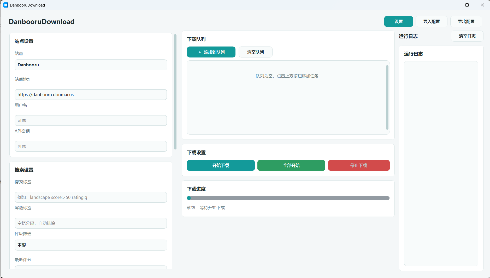
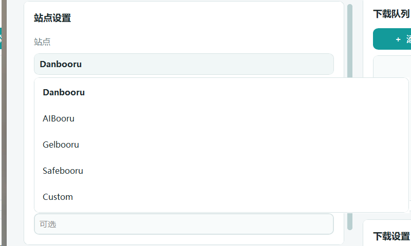
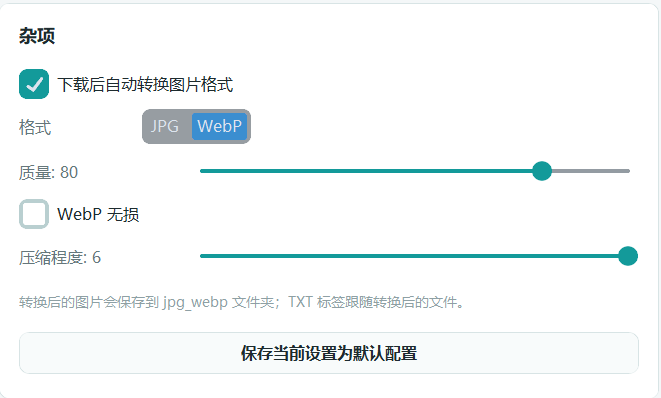
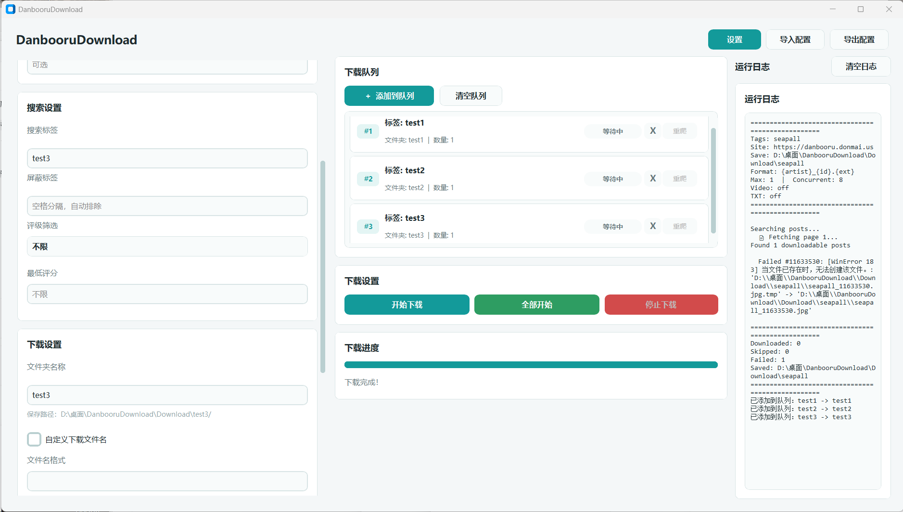

# BooruDownload

快速、易用的 Danbooru 及兼容站点批量下载工具，提供 CustomTkinter 图形界面和命令行两种使用方式。

A fast Windows-friendly batch downloader for [Danbooru](https://danbooru.donmai.us) and compatible booru sites, with both a CustomTkinter GUI and a CLI.

Current version: `v1.4.0`

v1.4.0 renames the project to BooruDownload (it long ago outgrew Danbooru-only support) and hardens the whole download pipeline: atomic file writes with streaming MD5 verification, path-escape protection, corrupt-file self-healing on Windows, safe cancellation, crash-free queue threading, and non-zero exit codes on failures. See [UPDATE.md](UPDATE.md) for the full changelog.

## 版本更新

当前版本：`v1.4.0`

本次版本将项目更名为 BooruDownload（支持站点早已不限于 Danbooru），并全面加固下载链路：原子写入 + 流式 MD5 校验、路径逃逸防护、Windows 损坏文件自愈、安全取消、队列线程不再触碰界面控件、失败时返回非零退出码。完整更新记录见 [UPDATE.md](UPDATE.md)。

## 中文说明

### 主要功能

| 功能 | 说明 |
| --- | --- |
| GUI 和 CLI | 双击 `start.bat` 使用图形界面，也可以用 `python main.py` 批量下载。 |
| 站点预设 | 内置 Danbooru、AIBooru、Gelbooru、Safebooru、Yande.re、Nozomi.la，也支持自定义站点地址。 |
| 下载队列 | 可以把多个标签搜索加入队列，按顺序下载、查看单项进度，并对失败任务重爬。 |
| 并发下载 | 异步下载引擎，支持自定义并发数和请求超时。 |
| 智能跳过 | 已存在文件会进行 MD5 校验，避免重复下载。 |
| 同名 TXT 标签 | 可为每张图片生成同名 `.txt` 标签文件，适合数据集和 LoRA 工作流。 |
| 自动格式转换 | 下载后可自动转换为 JPG 或 WebP，支持质量、WebP 无损和压缩程度配置；可选转换后删除原图。 |
| 暗色主题 | 设置页可切换浅色/深色界面，主题偏好保存在 `default_config.yaml`。 |
| 默认配置 | 设置窗口可保存当前设置为 `default_config.yaml`，下次启动自动加载。 |
| 全局 API 配置 | 设置 → API 认证中按站点预设保存凭据到 `api_credentials.yaml`；Gelbooru 需填写数字 User ID + API Key。 |
| YAML 配置 | 支持导入、导出下载设置、队列任务、TXT 标签选项和图片转换选项。 |
| 视频控制 | 可选择下载或跳过 `mp4`、`webm`、`zip` 动图/视频文件。 |

### 环境要求

- Windows
- Python 3.10 或更高版本
- 能访问目标 booru 站点

手动安装依赖：

```bash
pip install -r requirements.txt
```

依赖包括 `httpx`、`httpcore[asyncio]`、`typing_extensions`、`tqdm`、`pyyaml`、`customtkinter`、`Pillow`。

### Windows 下载

正式 Windows 安装包请从 [GitHub Releases](https://github.com/storyAura/BooruDownload/releases/latest) 下载：

1. 下载 `BooruDownload-v1.4.0-win-x64.zip`
2. 解压到任意目录
3. 运行 `BooruDownload.exe`
4. 运行依赖位于 `win-x64/` 文件夹，默认下载目录为 `Download/`

开发者仍可使用 `start.bat` 从源码启动，或使用 `build_exe.bat` 自行打包。

### 快速开始

```bash
git clone https://github.com/storyAura/BooruDownload.git
cd BooruDownload
```

启动 GUI：

```bat
start.bat
```

`start.bat` 会创建或修复 `.venv`，安装缺失依赖，然后用 `pythonw` 启动 `gui.py`。

打包 Windows EXE：

```bat
build_exe.bat
```

`build_exe.bat` 会安装打包依赖、运行测试和编译检查，然后输出 `dist\BooruDownload\BooruDownload.exe`。运行依赖放在 `win-x64` 文件夹，根目录只保留必要的 `Download` 下载文件夹。日常用户请优先从 Releases 下载；开发者快速测试推荐使用 `start.bat`。

### 实机演示

主界面：



站点预设：



自动转换设置：



下载队列和运行日志：



### GUI 使用

1. 选择站点预设，或输入自定义站点地址。
2. 输入搜索标签、评级、最低评分和屏蔽标签。
3. 设置保存目录和文件名格式。
4. 设置并发数、超时、跳过已存在文件、视频下载等选项。
5. 可选开启同名 TXT 标签导出。
6. 可选在设置窗口的“杂项”里开启自动图片转换，并选择 JPG/WebP、质量、WebP 无损和压缩程度。
7. 搜索多个标签时用空格分隔，例如 `1girl solo rating:g`。Gelbooru、Safebooru 同样使用空格分隔多标签。
8. 点击 `当前开始下载` 执行单次任务，或把多个任务加入队列后点击 `队列开始下载`。

### API 认证（全局）

1. 打开 **设置 → API 认证**。
2. 选择站点预设（如 Gelbooru）。
3. 按页面说明填写凭据并点击 **保存 API 配置**。
4. Gelbooru 需填写账户 Options 页中的 **数字 User ID** 和 **API Key**，不是登录用户名。
5. 凭据保存在程序目录下的 `api_credentials.yaml`，与任务配置 `default_config.yaml` 分离。

### 自动图片转换

开启 `下载后自动转换图片格式` 后，默认仍保留原图；可在设置中取消勾选 **保留原始文件**，转换成功后仅保留 `原文件夹名_webp` 或 `原文件夹名_jpg` 中的文件。保留原图时的目录结构如下：

```text
Download/example/image.png
Download/example_webp/image.webp
```

可配置项：

- 格式：`JPG` 或 `WebP`
- 保留原始文件：默认开启；关闭后转换成功时删除原图
- 质量：`1..100`
- WebP 无损：仅 WebP 生效
- 压缩程度：`0..6`
- WebP 透明背景：`white`、`color`、`random`
- WebP 彩色背景色：`#RRGGBB`，默认 `#ff4fd8`

如果同时开启 TXT 标签导出，`.txt` 会跟随转换后的文件：

```text
Download/example_webp/image.webp
Download/example_webp/image.txt
```

### 同名 TXT 标签

开启 `保存同名 TXT 标签` 后，每张图片旁边会生成同名 `.txt` 文件：

```text
image_name.png
image_name.txt
```

标签按 Danbooru 侧栏顺序写入：

```text
artist, copyright, character, general, meta
```

GUI 默认选择 `character` 和 `general`。可选将下划线转为空格，并转义括号等特殊字符。

CLI 如需生成 TXT 或启用图片转换，可通过 YAML 配置开启：

```yaml
save_tag_txt: true
tag_txt_categories:
  - character
  - general
tag_txt_underscore_to_space: true
tag_txt_escape_special_chars: true
auto_convert_images: true
auto_convert_format: webp
auto_convert_quality: 95
auto_convert_lossless: false
auto_convert_effort: 6
auto_convert_background_mode: color
auto_convert_background_color: "#ff4fd8"
auto_convert_keep_original: true
```

然后运行：

```bash
python main.py --config my_config.yaml
```

### Gelbooru（需要 API 凭据）

Gelbooru 已关闭匿名 API 访问，所有请求都必须携带账户凭据，否则会返回 `401 Unauthorized`。在站点预设中选择 Gelbooru 时，界面会在站点下方显示提醒。

- 登录 Gelbooru，打开 **My Account → Options**，复制 **数字 User ID** 和 **API Key**
- 在 **设置 → API 认证** 中填写（用户名一栏填数字 User ID），保存后即可下载

### 关于 Konachan

Konachan 目前对 API 请求启用了 Cloudflare 人机验证（JS 质询），任何纯 HTTP 客户端都无法匿名访问，因此已从站点预设中移除。如仍需尝试，可在站点地址栏手动输入 `https://konachan.com`（能否成功取决于 Cloudflare 是否放行）。

### Nozomi.la

Nozomi.la 使用独立的标签索引 API，不支持 Danbooru 风格的 `rating:`、`score:` 等 metatag；若任务中包含这些条件，程序会在日志中提示已忽略。

- 标签用空格分隔，例如 `1girl solo`
- 无需 API 认证
- 在站点预设中选择 **Nozomi.la** 即可
- 静态图片均以 `.webp` 格式提供（程序会自动使用正确的媒体地址）

### CLI 用法

```bash
# 基础搜索
python main.py -t "landscape rating:g" -l 20

# 评级和评分过滤
python main.py -t "1girl solo" --rating s --min-score 100

# 使用兼容镜像站
python main.py -u "https://safebooru.donmai.us" -t "scenery" -l 50

# 自定义保存目录和文件名
python main.py -t "touhou" -o ./touhou -f "{artist}_{id}.{ext}" -c 12

# 从 YAML 读取配置
python main.py --config my_config.yaml

# 保存当前 CLI 参数到 YAML
python main.py -t "landscape" -l 50 --save-config my_config.yaml
```

### CLI 参数

| 参数 | 说明 | 默认值 |
| --- | --- | --- |
| `-t`, `--tags` | 搜索标签，支持 Danbooru metatag | 空 |
| `--rating` | 评级过滤：`g`、`s`、`q`、`e` | 不限 |
| `--min-score` | 最低评分 | 不限 |
| `-o`, `--output` | 保存目录 | `./downloads` |
| `-f`, `--format` | 文件名模板 | `{id}_{artist}_{md5}.{ext}` |
| `-l`, `--limit` | 最大下载数量 | `100` |
| `-c`, `--concurrent` | 并发下载数 | `8` |
| `-u`, `--url` | Danbooru 兼容站点地址 | `https://danbooru.donmai.us` |
| `--username` | API 用户名 | 空 |
| `--api-key` | API 密钥 | 空 |
| `--config` | 读取 YAML 配置 | 空 |
| `--save-config` | 保存配置到 YAML 后退出 | 空 |
| `--no-skip` | 重新下载已存在文件 | 关闭 |
| `--timeout` | HTTP 超时秒数 | `30` |

### 文件名占位符

| 占位符 | 说明 | 示例 |
| --- | --- | --- |
| `{id}` | 帖子 ID | `12345` |
| `{md5}` | 文件 MD5 | `a1b2c3d4...` |
| `{artist}` | 画师标签 | `artist_name` |
| `{character}` | 角色标签 | `hatsune_miku` |
| `{copyright}` | 版权/作品标签 | `vocaloid` |
| `{rating}` | 评级 | `g` |
| `{score}` | 评分 | `150` |
| `{date}` | 上传日期 | `2025-01-15` |
| `{width}` | 图片宽度 | `1920` |
| `{height}` | 图片高度 | `1080` |
| `{ext}` | 文件扩展名 | `png` |
| `{tags}` | 前 10 个通用标签 | `tag1+tag2+...` |

GUI 默认文件名格式：

```text
{artist}_{id}.{ext}
```

CLI 默认文件名格式：

```text
{id}_{artist}_{md5}.{ext}
```

## English

### Highlights

| Feature | Description |
| --- | --- |
| GUI and CLI | Use the graphical app from `start.bat`, or automate downloads with `python main.py`. |
| Site presets | GUI presets for Danbooru, AIBooru, Gelbooru, Safebooru, Yande.re, Nozomi.la, plus custom URLs. |
| Download queue | Add multiple tag searches to the GUI queue, run them in order, retry tasks, and track per-task progress. |
| Concurrent downloads | Async downloader with configurable concurrency and request timeouts. |
| Smart skipping | Existing files are checked by MD5 so repeated runs do not waste bandwidth. |
| TXT tag export | Optionally save a same-name `.txt` file for each image, useful for dataset and LoRA workflows. |
| Image conversion | Convert downloaded still images to JPG or WebP with quality, lossless WebP, and compression controls; optionally remove originals after conversion. |
| Dark theme | Switch light/dark UI in Settings; theme preference is saved in `default_config.yaml`. |
| Default config | Save the current GUI settings as `default_config.yaml` and load them automatically on next start. |
| Global API credentials | Configure per-site credentials in Settings -> API Credentials; saved to `api_credentials.yaml`. Gelbooru requires numeric User ID + API Key. |
| YAML configs | Import/export settings, queued tasks, TXT tag options, and image conversion options. |
| Video control | Choose whether to download or skip `mp4`, `webm`, and `zip` animation files. |

### Download (Windows)

Get the official Windows bundle from [GitHub Releases](https://github.com/storyAura/BooruDownload/releases/latest):

1. Download `BooruDownload-v1.4.0-win-x64.zip`
2. Extract it to any folder
3. Run `BooruDownload.exe`
4. Runtime files live in `win-x64/`; the default download folder is `Download/`

Developers can still launch from source with `start.bat`, or rebuild with `build_exe.bat`.

### Quick Start

```bash
git clone https://github.com/storyAura/BooruDownload.git
cd BooruDownload
```

```bat
start.bat
```

`start.bat` creates or repairs `.venv`, installs missing dependencies, and launches `gui.py` with `pythonw`.

To build the Windows EXE:

```bat
build_exe.bat
```

`build_exe.bat` installs build dependencies, runs tests and compile checks, then writes `dist\BooruDownload\BooruDownload.exe`. Runtime files are placed in `win-x64`, and the bundle root keeps only the necessary `Download` folder for downloaded files. End users should download from Releases; for quick development testing, keep using `start.bat`.

### Screenshots

Main interface:


Site presets:


Image conversion settings:


Download queue and logs:


### CLI Usage

```bash
python main.py -t "landscape rating:g" -l 20
python main.py -t "1girl solo" --rating s --min-score 100
python main.py -u "https://safebooru.donmai.us" -t "scenery" -l 50
python main.py -t "touhou" -o ./touhou -f "{artist}_{id}.{ext}" -c 12
python main.py --config my_config.yaml
python main.py -t "landscape" -l 50 --save-config my_config.yaml
```

Use spaces between multiple search tags, for example `1girl solo rating:g`. Gelbooru and Safebooru use the same space-separated tag query style.

### YAML Queue And Conversion Example

```yaml
queue_tasks:
  - tags: "1girl solo"
    folder_name: "solo"
    max_posts: 100
auto_convert_images: true
auto_convert_format: webp
auto_convert_quality: 95
auto_convert_lossless: false
auto_convert_effort: 6
auto_convert_background_mode: color
auto_convert_background_color: "#ff4fd8"
auto_convert_keep_original: true
```

### Gelbooru (API credentials required)

Gelbooru has disabled anonymous API access; every request must carry account credentials or it returns `401 Unauthorized`. When you pick Gelbooru in the site preset menu, the GUI shows a reminder beneath the site picker.

- Log in to Gelbooru, open **My Account → Options**, and copy your **numeric User ID** and **API Key**
- Enter them in **Settings → API Credentials** (the username field takes the numeric User ID), then save

### Konachan

Konachan currently gates its API behind a Cloudflare JS challenge that blocks any plain HTTP client, so it has been removed from the site presets. You can still try it by typing `https://konachan.com` into the site URL field, though success depends on whether Cloudflare lets the request through.

### Nozomi.la

Nozomi.la uses its own tag index API and does not support Danbooru-style metatags such as `rating:` or `score:`. Unsupported metatags are ignored and logged.

- Separate tags with spaces, for example `1girl solo`
- No API credentials required
- Select **Nozomi.la** from the site preset menu
- Static images are served as `.webp`; the app resolves the correct media URL automatically

Queue tasks are currently used by the GUI. The CLI loads common download settings, TXT tag settings, and image conversion settings.

## Project Structure

```text
BooruDownload/
|-- gui.py                     # Compatibility GUI entry point
|-- main.py                    # Compatibility CLI entry point
|-- config.py                  # Compatibility wrapper
|-- danbooru_client.py         # Compatibility wrapper
|-- downloader.py              # Compatibility wrapper
|-- formatter.py               # Compatibility wrapper
|-- booru_download/
|   |-- cli.py                 # CLI implementation
|   |-- core/
|   |   |-- config.py          # YAML config model and loader
|   |   |-- danbooru_client.py # Booru API client and post normalization
|   |   |-- nozomi_client.py   # Nozomi.la tag index and post metadata
|   |   |-- downloader.py      # Async streaming downloader
|   |   |-- formatter.py       # Filename and TXT tag formatters
|   |   `-- image_conversion.py # JPG/WebP conversion helpers
|   |-- ui/
|   |   `-- app.py             # CustomTkinter GUI
|   `-- locales/               # Chinese and English UI text
|-- docs/screenshots/          # README screenshots
|-- tests/                     # Unit tests
|-- start.bat                  # Windows launcher
|-- api_credentials.yaml       # Global API credentials (created from Settings)
|-- build_exe.bat              # PyInstaller packaging script
|-- BooruDownload.spec      # PyInstaller onedir build config
|-- requirements-build.txt     # Packaging-only dependencies
`-- requirements.txt           # Python dependencies
```

## License

Released under the [MIT License](LICENSE).
